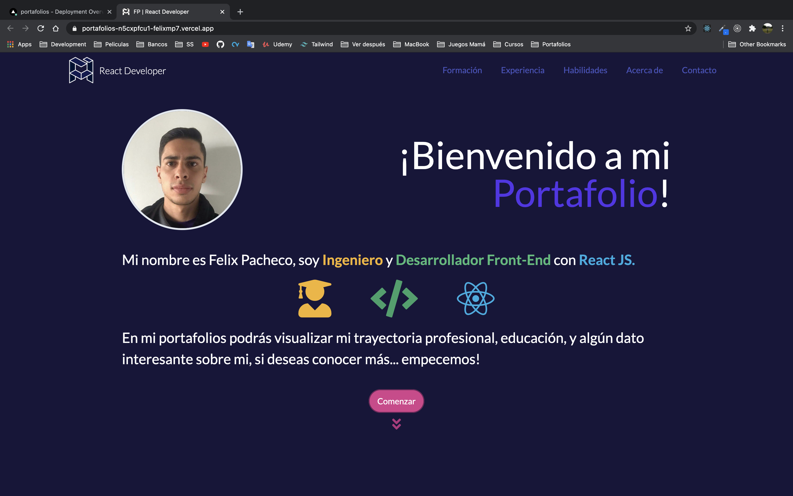
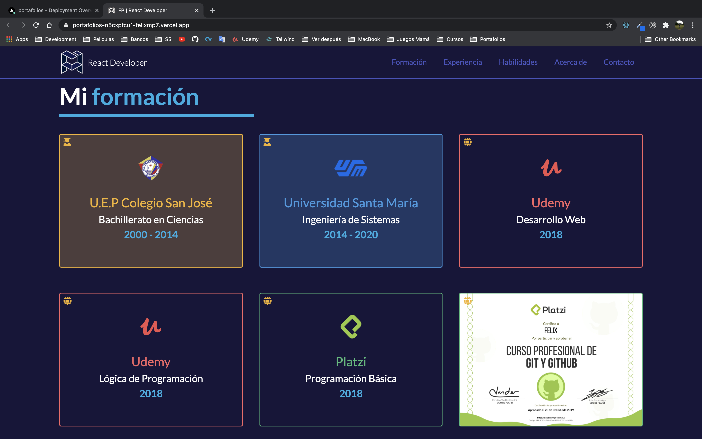
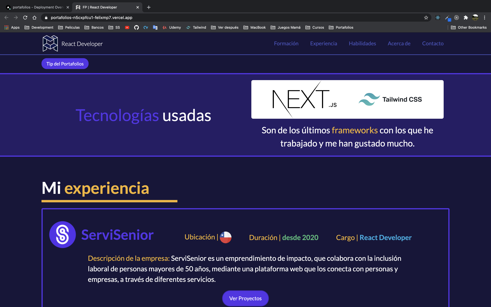
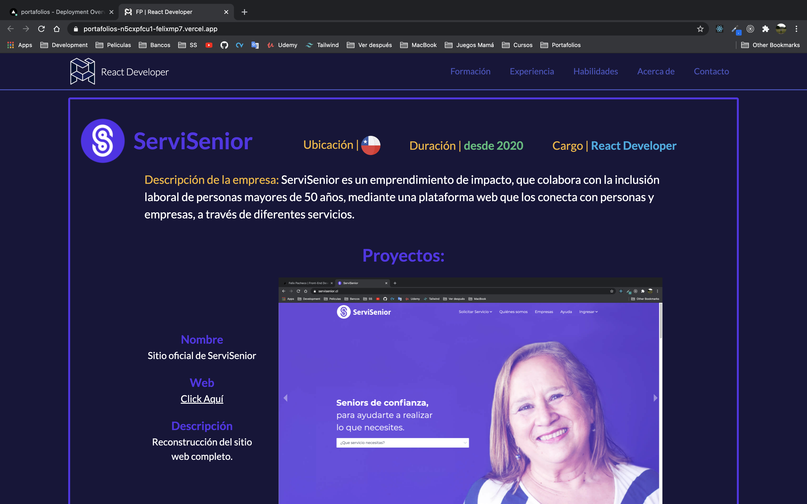
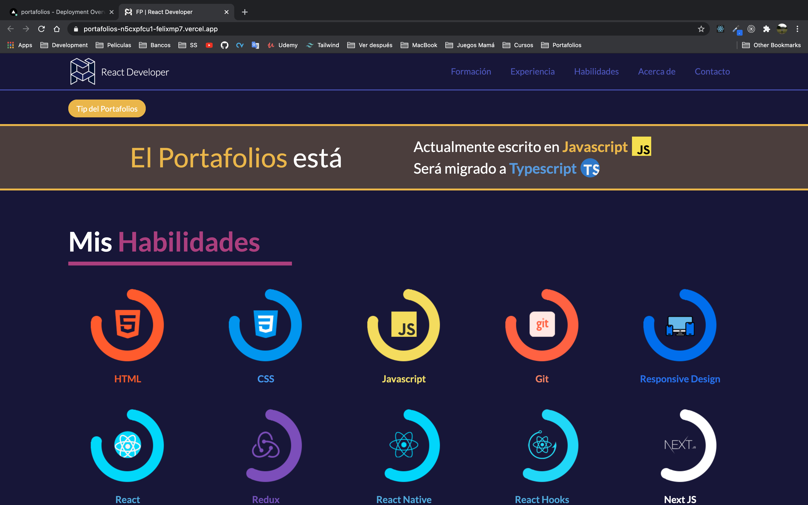
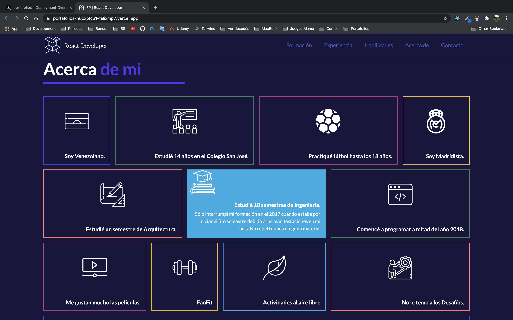
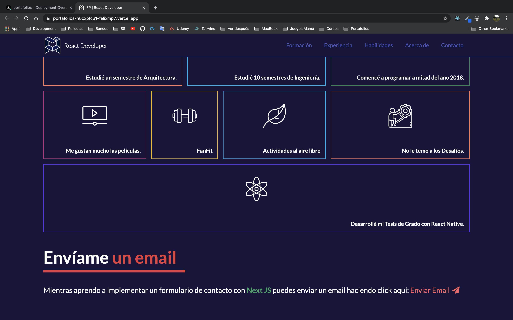

This is a [Next.js](https://nextjs.org/) project bootstrapped with [`create-next-app`](https://github.com/vercel/next.js/tree/canary/packages/create-next-app).

## Getting Started

First, clone project with:
```bash
git clone <http or SSH>
```
Soon, install dependencies with:
```bash
npm install
# or
yarn
```

Finally, run the development server:

```bash
npm start
# or
yarn start
```

Open [http://localhost:3000](http://localhost:3000) with your browser to see the result.


## Deployed in Vercel

The Portfolio is displayed in Vercel.

- [Production Deploy](https://portafolios-git-main-felixmp7.vercel.app/)
- [Development Deploy](https://portafolios-n5cxpfcu1-felixmp7.vercel.app)

Check out [Next.js deployment documentation](https://nextjs.org/docs/deployment) for more details.

## Screenshots







